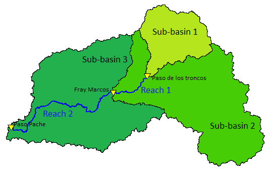

```{r setup, echo=F, warning=F, message=F}
# root dir
knitr::opts_knit$set(root.dir = "C:/Users/rver4657/owncloud/Uruguay/coursematerial")
knitr::opts_chunk$set(echo = TRUE)
require(tidyverse)
require(lubridate)
require(hydromad)
require(knitr)
```

This is part of a course taught at IMFIA UdelaR in collaboration with MSc Jimena Alonso in July 2018. It is part of the project INIA-IRI-USYD.

```{r logos, echo=F}
include_graphics("logos.png")
```

# Introduction

Packages needed  
```{r, eval = FALSE}
require(tidyverse)
require(lubridate)
require(hydromad)
```

So far we have worked with lumped models, which aggregate the whole catchment into one unit. To give you some understanding of what the advantage of using a distributed model is, we have constructed a simple semi-distributed model.

The model consists of a single stream, which can split into multiple subbasins, left and right of the main stream. A picture of a system with 3 sub basins (which we will use in this practical) is below.

```{r, echo=F}

```

Each of the subbasins is modelled with a GR4J model form hydromad, while the connecting stream uses the Muskingum routing equation to move water downstream. 

## Mass balance or continuity equation
All river routing in rivers is based on a mass balance approach, i.e. the river section is assumed to be a storage in which the flood wave can be slowed down and spread out by storage. These two alterations of a flood wave are called translation and attenuation. The central equation is the so-called storage equation, which is simply a mass balance equation:  

$I-Q=\frac{dS}{dt}$    (1)     

In words: inflow-outflow equals the change in storage. For general calculations, a finite difference form is generally more useful:

$\frac{1}{2}(I_t +I_{t+1}) - \frac{1}{2}(Q_t+Q_{t+1})=]\frac{(S_{t+1}-S_t)}{\Delta t}$    (2)  

$\frac{2S_{t+1}}{\Delta t}+Q_{t+1}=I_t+I_{t+1}+(\frac{2S_t}{\Delta t}-Q_t)$  (3)  

Where $\Delta t$ is the size of the time step. At each time step $I_t$, $I_{t+1}$, $S_t$ and $Q_t$ are known, these are the so-called initial conditions. However, this leaves a system with two unknowns ($Q_{t+1}$ and $S_{t+1}$). This means a second equation is needed to solve the equation and this is the equation which describes Storage.  


## Muskingum method  
The Muskingum method was first developed for the Muskingum River (Ohio) and deals with flood routing in rivers, and is the flood routing method employed in many models (including SWAT). It is an empirical model that assumes that the storage is a function of both the inflow and the outflow:  

$S=f(I,Q)$ or $S=k[XI+(1-X)Q]$    (4)  

In Equation 4 *k* is a travel time constant, which determines the rate at which the flood peak moves through the reach and X is a parameter which weighs the contributions of the inflow and outflow on the storage in the reach and determines the attenuation of the peak flow. Inserting equation 4 into equation 2 gives the Muskingum operating equations:  

$Q_{t+1}=C_0 I_{t+1}+C_1 I_t+C_2 Q_t$  

$C_0 = \frac{-kX+0.5\Delta t}{k(1-X)+0.5\Delta t}$  

$C_1 = \frac{kX+0.5\Delta t}{k(1-X)+0.5\Delta t}$  

$C_2 = \frac{k(1-X)-0.5\Delta t}{k(1-X)+0.5\Delta t}$       (5)     

The coefficients $C_0$, $C_1$, $C_2$ must be positive and sum to 1.  
The trick is to find the values of $C_1$, $C_2$ and $C_0$. The parameter *X* is generally estimated at 0.2 - 0.3 for natural streams, and gives the balance between the weighting of inflow and outflow. If *X* is 0, than the inflow has no effect on the outflow, 0.5 gives equal weighting. This last option gives translation, but little attenuation. In general:    

- X = 0.2 for most cases  
- X = 0.4 for steep channels with narrow flood plains  
- X = 0.1 for mild channels with broad flood plains  

# Definition of the semi-distributed model

To help the modelling, we have written the model as a function in the `GR4J@distr.R` script, which can be loaded using (relative to your working dir): 
```{r}
source("Rcode_IMFIA_course2018/GR4J@distr.R")
```

This loads six functions in your environment. The first is the actual model function, `GR4JSubBasins.run()`, the other is a specific objective function, `DistGR4J_objfun()`, which can be used with `optim()` to minimise the required internal objective function (such as "r.squared").

Finally there are the function for muskingum routing, `muskingum()`, and three utility functions: 1) to rewrite the parameters, `rewrite_par`; 2) to plot the results, `plot_results()`; and 3) to calculate statistics `stats_fun()`  

The arguments for the `GR4JSubBasins.run()` function are:  
- *sb*, which is the number of subbasins to simulate;  
- *order*, which is the order in which the basins are connected;  
- *Data*, which is a hydromad zoo input data frame with 3 columns for each of the subbasins;  
- *spar*, which is the list with **named** parameter estimates for GR4J for the subbasins (etmult, x1, x2, x3, x4);  
- *rpar*, which is a list with **named** parameters for the Muskingum routing, this is *k*, *x* ;  
- *sbnames*, and optional vector of length sb with names of the sub catchment;  

The arguments for the `DistGR4J_objfun()` function are:  

- *x*, a vector of parameter estimates to be calibrated;  
- *par* is a vector with the parameters to optimise c( par.sub1, par.sub2, parsub...., rpar1, rpar2,....). The length of par depends on the number of subbasins and the p parameters to optimise;  
- *calibrate_on* is a vector of positions that relate x to par;  
- *Data*, which is the input daya, similar to `GR4JSubBasins.run()`
- *model_input* is an optional list of all the `GR4JSubBasins.run()` function input except the data and the parameters. The default is the 3 subbasin Santa Lucia basin;   
- *objective*, is an optional character term of one of the hmadstats(), but currently only objectives that can be **maximised** are implemented, the default is to use NSE or "r.squared".  

## The data  
To help you, we have created an Rdata file that includes all the data and all the parameters for the model.  
```{r}
load("data/SL_distdata.RDATA")
```

This will load the following objects in your environment related to the Santa Lucia catchment:  
- *SL_distdata* the zoo data frame with data for all the subbasins;  
- *All_par* a list with GR4J parameters for subbasin 1, 2 and 3;    
- *All_reach.par* a list with the Muskingum parameters for the two reaches connecting the sub basins.  

Here is a short demo of what is in the data:
The data
```{r show_data}
head(SL_distdata)
```

Parameters for the subbasins are in the All_par object
```{r Subbasin_parameters}
# for subbasin 1:
All_par$Sub1.par
names(All_par)
```

Parameters for the reach are in All_reach_par object 
```{r reach_par}
# for subbasin 1:
All_reach_par$reach1.par
names(All_reach_par)
```


## Defining the model function

Select a window of the data, because it is a zoo data frame, we can use `window()` on the data.
```{r define_data_window}
# Use data for 2000 - 2005
Data_in <- window(SL_distdata,
                       start = "2000-01-01",
                       end ="2005-12-31")
```

An example of the definition of the model function for a three sub basin model of the Santa Lucia catchment is given below. We have kept it as simple as possible.

```{r Setup_model}
SLrun = GR4JSubBasins.run(sb=3,
                          order = c(1,2,3),
                          Data = Data_in,
                          spar = All_par,
                          rpar = All_reach_par,
                          sbnames = c("PasoTroncos",
                          "FrayMarcos",
                          "PasoPache"),
                          return_state = T)
```

The `return_state` variable allows you to return all the input as well as the output.

We can plot the output, which is a zoo data.frame with for this example 12 columns (input and output for the three stations). We have not yet implemented true "methods", byt xyplot() works.

```{r plot_model_output}
xyplot(SLrun)
```

# Optimisation of the model

To optimise the model, we need to use `optim()`, as the model is not fully integrated in hydromad. So this simply follows the linear regression optimisation example.

This means we need to give initial guesses of the parameters and construct the model input as a list

## Create the input for the optimisation function

### step 1  
Define the initial guesses of the parameters to optimise
This is the vector x in model optimisation

You can just type numbers, but I am using parts of the existing lists to create the vector. They have to be in the right order.

```{r Define_initial_guess}
# initial guesses, using the SubX.par in All_par. and
# reachX.par in All_reach_par, where X is a number
x <- c(All_par$Sub1.par[2:5], All_par$Sub2.par[2:5],
  All_par$Sub3.par[2:5], All_reach_par$reach1.par,
  All_reach_par$reach2.par)
```

### step 2  

Create the vector for par_in, which is all the parameters in the model, again using the parameter lists that we loaded.

```{r Define_all_pars}
# all the parameters of the model
par_in <- c(All_par$Sub1.par[1:5], All_par$Sub2.par[1:5],
  All_par$Sub3.par[1:5], All_reach_par$reach1.par,
  All_reach_par$reach2.par)
```

### step 3  
Identify which positions in par_in relate to x, so which parameters in the whole series in par_in are actually calibrated. We want to select all the "x" parameters in GR4J and not etmult, and we want to calibrate both routing parameters.

```{r define_Fit_these}
# define which parameters to calibrate
# We want to
Fit_these <- c(2:5,7:10,12:15,16,17,18,19) 
```


### step 4  
Finally, we need to construct a list which defines the remaining model input
For the data, we have already created Data_in, so we will use this again. The rest of the model are given defaults (see below), so if you like these, this input is optional.

```{r define_rest_model}
# Use data for 2000 - 2005
# created earlier as Data_in
# define the model_input (optional, as these are the defaults)
model_input_in <- list(sb = 3, order = c(1,2,3),
                        sbnames = c("PasoTroncos",
                        "FrayMarcos",
                        "PasoPache"))
```

## fit the model using optim()
Now you can run the objective function using optim()

```{r fit_model_optim}
Fit_SL <- optim(par = x, # values of the parameters to fit
    DistGR4J_objfun, # function to fit
    calibrate_on = Fit_these, # which positions of parameters
    parM = par_in, # all parameters
    Data = Data_in, # The input data (Q,P,E)
    model_input = model_input_in, # (opt) rest model input
      objective = "r.squared", # objective function(optional)
    weights = c(1,1,1), # weights (optional)
    method="BFGS") # options for optim

Fit_SL$par
```

With optim() and using "Nelder-Mead" there is an issue that the choice of initial parameters influences the model fit. You can fiddle with the estimates and refit a couple of times, but this is not optimal. Using "BFGS" is slower, but might give more reliable results.

## show plot of predicted versus observed

This means we need to  use the fitted values, by re-predicting the model using the above data. Because we have not yet implemented full hydromad methods, we have to do this a bit slower than in hydromad, were we can use a runlist

### step 1  
Insert parameters back into the model, we can do this easier using the utility function `rewrite_pars()`, which takes as inputs the old parameters and the new fitted parameters.

```{r _rewrite_pars}
# insert fitted values into parameters
# using rewrite_pars()
# this creates a list of reach and sub parameters
new_pars <- rewrite_pars(All_par,All_reach_par,Fit_SL$par)
str(new_pars)
```

### step 2  
We can now rerun the model with the new parameters, which means we make a prediction. In this case we repredict the data, but you could use the same function to predict new data for a validation.

```{r predict_model}
Fitted_SL <- GR4JSubBasins.run(sb=3,
                          order = c(1,2,3),
                          Data = Data_in,
                          spar = new_pars$sub,
                          rpar = new_pars$reach,
                          sbnames = c("PasoTroncos",
                                      "FrayMarcos",
                                      "PasoPache"))

xyplot(Fitted_SL)
```

This plot is just the predicted values, we want to know how well it predicts the observed values. For this we want to make a plot and calculate some statistics to show how good the fit is.


### step 3  
I am here using ggplot and create a dataframe that includes both the fitted and the observed data for each subcatchment. We can make this plot easily using the utility `plot_results()` function. The output of this function is a data frame with the observed and fitted results.  
```{r plot_fitted_obs}
# plot using `plot_results()`
results <- plot_results(Fitted_SL,Data_in)
# this creates a data frame with observed and fitted Q
```

### step 4  
We can now calculate the statistics using the output of the last function, and the utility function `stats_fun()`

```{r calculate_stats}
# using stats_fun on results
stats_fun(results, decimal=2)

```

This is a reasonable fit for the multi-objective calibration, where the optimisation is forced to fit all the gauges at the same time, with equal weight. 

Two alternatives to this are:  

1. Different weights for the different stations.  
2. calibrate the stations one at a time in sequence.

However, we will first deal with Monte Carlo and behavioural thresholds.